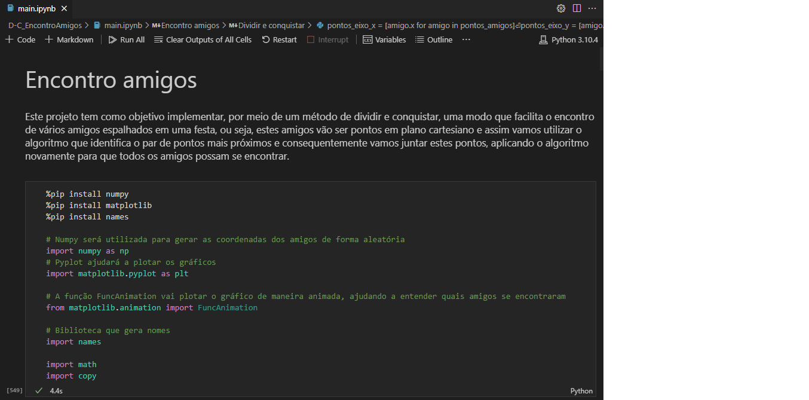
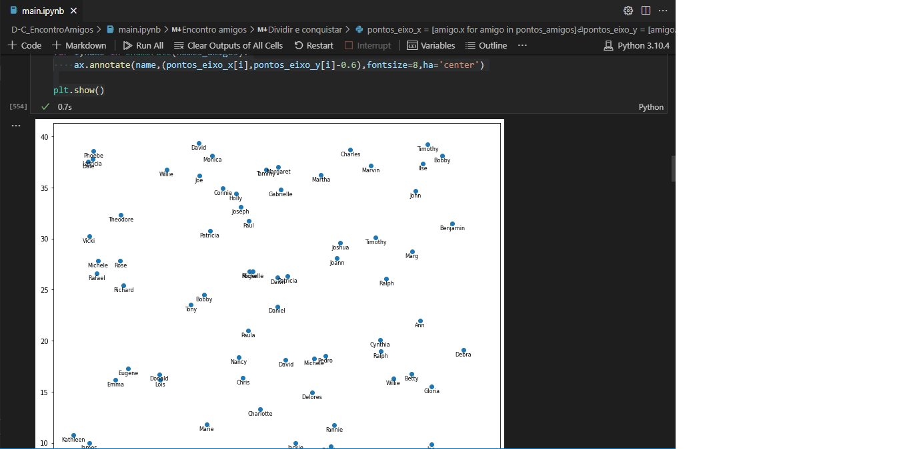
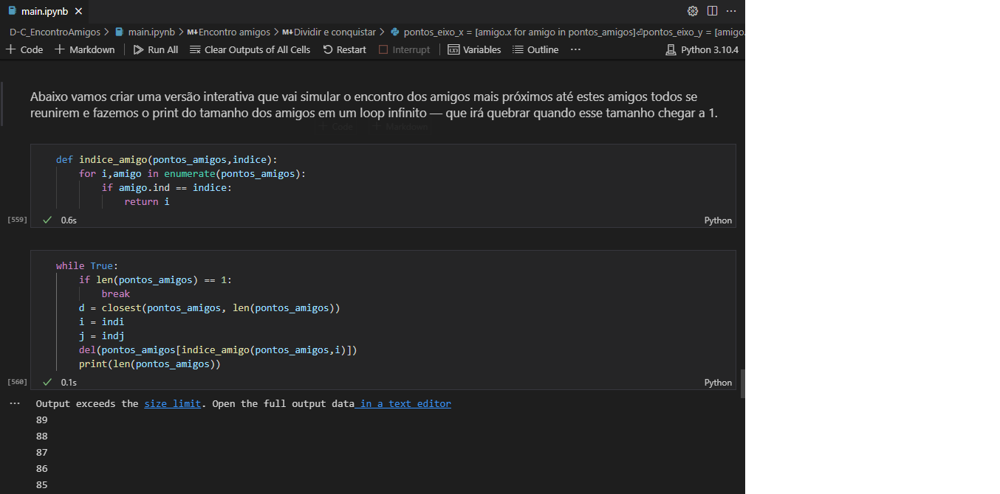

# Encontro Amigos 

**Número da Lista**: 4<br>
**Conteúdo da Disciplina**: D&C<br>

## Alunos
|Matrícula | Aluno |
| -- | -- |
| 18/0102656  |  Ítalo Vinícius |
| 18/0145088  |  Gabriel Bonifácio |

## Sobre 
O objetivo do nosso projeto é, dada uma certa quantidade de amigos numa festa, fazer com que eles se encontrem em um único ponto em comum. A ideia é utilizar a lógica de juntar os pares mais próximos, até que se tornem apenas um no final.

## Apresentação

Para acessar a apresentação, basta acessar este link: <a href="https://www.youtube.com/watch?v=-l7Or-ivfDA" target="_blank">https://www.youtube.com/watch?v=-l7Or-ivfDA</a>.

## Screenshots

<div align="center">

  

  [Figura 1: Imagem do programa](./images/img1.png)

</div>
  
<div align="center">

  
  
  [Figura 2: Imagem do programa](./images/img2.png)
  
 </div>
  
<div align="center">

  
  
  [Figura 3: Imagem do programa](./images/img3.png)
  
</div>

## Instalação 

**Linguagem**: Python<br>
**Framework**: ------<br>

Siga as instruções a seguir para rodar o programa:

1) Fazer a instalação do Python, em uma versão superior a 3.6

2) Clonar o repositório.

  ```sh 
  git clone https://github.com/projeto-de-algoritmos/D-C_EncontroAmigos.git
  ```

3) Acessar a pasta da aplicação 

  ```sh 
  cd D-C_EncontroAmigos/
  ```

4) Analisar as soluções da seguinte pasta: 

  ```sh 
  main.ipynb
  ```

5) Você agora poderá testar e verificar as soluções.

## Uso 

Após avaliar, você poderá fazer suas considerações sobre o projeto.

## Outros 

Os nomes dos "amigos" foram retirados da biblioteca ('names')[https://pypi.org/project/names/]. 


